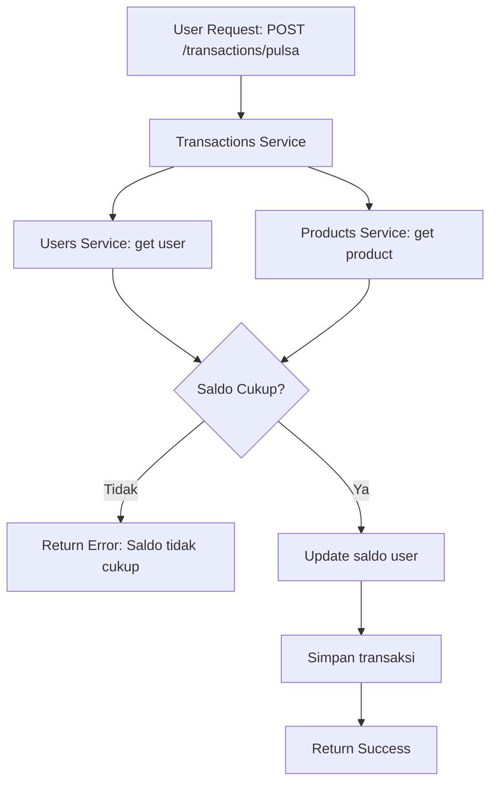

# 📦 Microservice Project – Gabungan Project 4 & 5  
Java Spring Boot • Docker • REST API • Microservice Architecture

Proyek ini merupakan penggabungan dari **Project 4 (Gateway + Eureka)** dan **Project 5 (Account Service)** menjadi satu arsitektur **Microservice** yang saling terhubung menggunakan **Eureka Server**, **API Gateway**, serta **User/Account Service**.

---
```
# 🚀 Arsitektur Sistem

[ Client ]
     |
     v
[ API Gateway ]
     |
     v
[ Eureka Server ] <--> [ Account Service ]
```

# 🔧 Teknologi yang Digunakan

- **Java Spring Boot**
- **REST API**
- **MySQL / MariaDB**
- **Docker Compose**
- **Spring Cloud Netflix**
- **API Gateway (Opsional)**
- **Eureka Discovery Server (Opsional)**

---

# 🧩 Daftar Service

### 1️⃣ Users Service  
Base URL: `/api/users`  
Fungsi: menyimpan data user & saldo  

### 2️⃣ Products Service  
Base URL: `/api/products`  
Fungsi: menyediakan katalog produk  

### 3️⃣ Transactions Service  
Base URL: `/api/transactions`  
Fungsi: mengelola transaksi pembelian pulsa  

---

# 📌 Endpoint Lengkap

## 🔹 Users Service

| Method | Endpoint | Deskripsi |
|--------|----------|-----------|
| GET | `/api/users/{id}` | Ambil data user berdasarkan ID |
| PUT | `/api/users/{id}/saldo` | Update saldo user |

---

## 🔹 Products Service

| Method | Endpoint | Deskripsi |
|--------|----------|-----------|
| GET | `/api/products/{id}` | Ambil detail produk |

---

## 🔹 Transactions Service

| Method | Endpoint | Deskripsi |
|--------|----------|-----------|
| POST | `/api/transactions/pulsa` | Transaksi pembelian pulsa |
| GET | `/api/transactions/history/{id}` | Riwayat transaksi user |

---

# 🗄️ Struktur Database

## 📌 Users Service
| Field | Type | Keterangan |
|-------|------|------------|
| id | INT (PK) | ID user |
| name | VARCHAR | Nama user |
| email | VARCHAR | Email user |
| saldo | INT | Saldo user |
| created_at | TIMESTAMP | Waktu pembuatan |

---

## 📌 Products Service
| Field | Type | Keterangan |
|-------|------|------------|
| id | INT (PK) | ID produk |
| name | VARCHAR | Nama produk |
| type | VARCHAR | Tipe produk (pulsa/data) |
| price | INT | Harga produk |
| provider | VARCHAR | Provider (Telkomsel/XL/dll) |

---

## 📌 Transactions Service
| Field | Type | Keterangan |
|-------|------|------------|
| id | INT (PK) | ID transaksi |
| user_id | INT (FK) | Relasi ke users |
| product_id | INT (FK) | Relasi ke products |
| amount | INT | Total harga |
| status | VARCHAR | SUCCESS/FAILED |
| created_at | TIMESTAMP | Waktu transaksi |

---

# 🔄 Flow Proses Transaksi


## 🐳 Cara Menjalankan dengan Docker

Pastikan Docker sudah terinstall pada perangkat Anda.

```bash
docker-compose up --build


